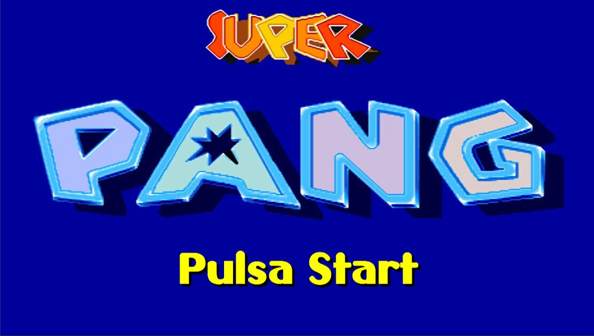
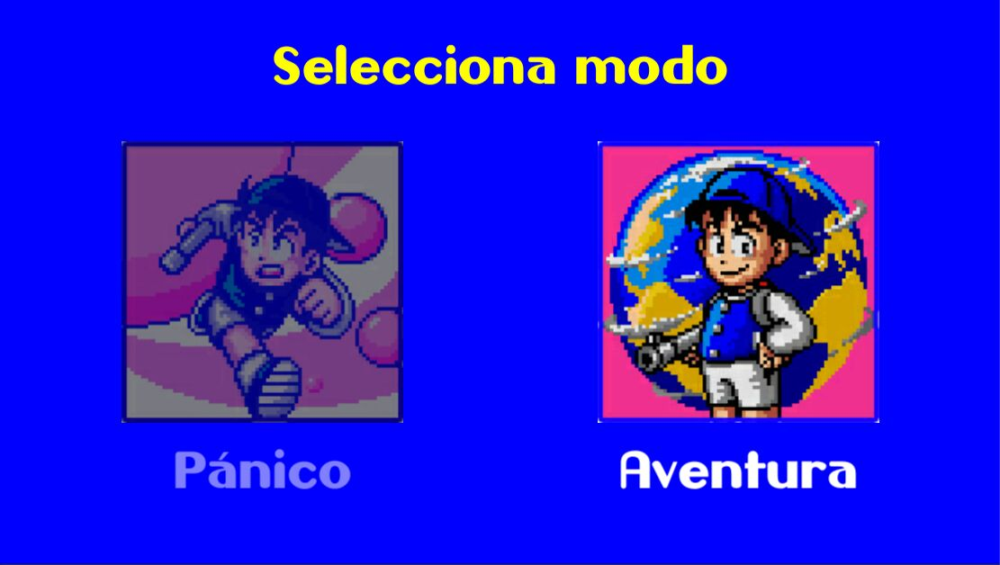
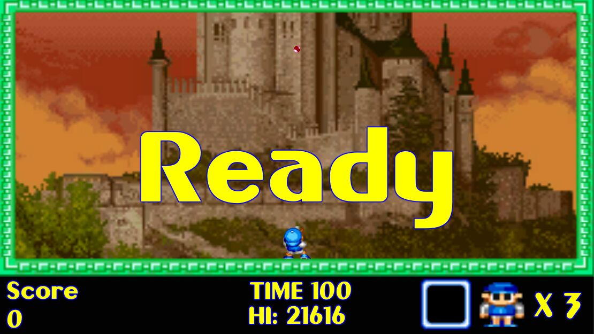

# Pang

## Características del proyecto

### Publicación

En este informe se presenta el proyecto **[Pang](https://github.com/AlbertoVf/pang)** que se encuentra disponible en GitHub bajo la licencia **[Apache 2.0](https://choosealicense.com/licenses/apache-2.0)**. La fecha de publicación en GitHub fue el **11/12/2019**.

### Descripción del proyecto

El proyecto es una versión para Windows del juego de árcade **Super Pang (1990)**. Este juego es un prototipo con un solo modo de juego.

## Codificación

### Lenguajes y Frameworks

- **C#** es un [lenguaje de programación](https://es.wikipedia.org/wiki/Lenguaje_de_programación) [multiparadigma](https://es.wikipedia.org/w/index.php?title=Lenguaje_de_programación_multiparadigma&action=edit&redlink=1) desarrollado y estandarizado por la [empresa](https://es.wikipedia.org/wiki/Empresa) [Microsoft](https://es.wikipedia.org/wiki/Microsoft) como parte de su plataforma [.NET](https://es.wikipedia.org/wiki/Microsoft_.NET), que después fue aprobado como un estándar por la [ECMA](https://es.wikipedia.org/wiki/Ecma_International) (ECMA-334) e [ISO](https://es.wikipedia.org/wiki/Organización_Internacional_de_Normalización) (ISO/IEC 23270). C# es uno de los lenguajes de programación diseñados para la [infraestructura de lenguaje común](https://es.wikipedia.org/wiki/Infraestructura_de_lenguaje_común). Su sintaxis básica deriva de [C](<https://es.wikipedia.org/wiki/C_(lenguaje_de_programación)>)/[C++](https://es.wikipedia.org/wiki/C%2B%2B) y utiliza el modelo de objetos de la plataforma .NET, similar al de [Java](<https://es.wikipedia.org/wiki/Java_(lenguaje_de_programación)>), aunque incluye mejoras derivadas de otros lenguajes.
- **Unity** es un [motor de videojuego](https://es.wikipedia.org/wiki/Motor_de_videojuego) multiplataforma creado por [Unity Technologies](https://es.wikipedia.org/wiki/Unity_Technologies). Unity está disponible como plataforma de desarrollo para [Microsoft Windows](https://es.wikipedia.org/wiki/Microsoft_Windows), [Mac OS](https://es.wikipedia.org/wiki/Mac_OS), [Linux](https://es.wikipedia.org/wiki/Linux). La plataforma de desarrollo tiene soporte de compilación con diferentes tipos de plataformas. A partir de su versión 5.4.0 ya no permite el desarrollo de contenido para navegador a través de su plugin web, en su lugar se utiliza WebGL.

### Entorno de programación

- **Microsoft Visual Studio** es un [entorno de desarrollo integrado](https://es.wikipedia.org/wiki/Entorno_de_desarrollo_integrado) (_IDE_, por sus siglas en inglés) para [Windows](https://es.wikipedia.org/wiki/Windows) y [macOS](https://es.wikipedia.org/wiki/MacOS). Es compatible con múltiples [lenguajes de programación](https://es.wikipedia.org/wiki/Lenguaje_de_programación), tales como [C++](https://es.wikipedia.org/wiki/Visual_C%2B%2B), [C#](https://es.wikipedia.org/wiki/C_Sharp), [Visual Basic .NET](https://es.wikipedia.org/wiki/Visual_Basic_.NET), [F#](https://es.wikipedia.org/wiki/F_Sharp), [Java](<https://es.wikipedia.org/wiki/Java_(lenguaje_de_programación)>), [Python](https://es.wikipedia.org/wiki/Python), [Ruby](https://es.wikipedia.org/wiki/Ruby) y [PHP](https://es.wikipedia.org/wiki/PHP), al igual que entornos de desarrollo web, como [ASP.NET](https://es.wikipedia.org/wiki/ASP.NET) MVC, Django, etc., a lo cual hay que sumarle las nuevas capacidades en línea bajo [Windows Azure](https://es.wikipedia.org/wiki/Windows_Azure) en forma del editor Mónaco. Visual Studio permite a los desarrolladores crear [sitios](https://es.wikipedia.org/wiki/Sitio_web) y [aplicaciones web](https://es.wikipedia.org/wiki/Aplicación_web), así como servicios web en cualquier entorno compatible con la [plataforma .NET](https://es.wikipedia.org/wiki/Microsoft_.NET) (a partir de la versión .NET 2002). Así, se pueden crear aplicaciones que se comuniquen entre estaciones de trabajo, páginas web, dispositivos móviles, dispositivos embebidos y videoconsolas, entre otros.
- **GIMP**: Editor fotográfico para todas las imágenes del juego
- **Unity Asset Store**: tienda de Unity donde descargue los audios y elementos necesarios para el juego.

### Control de versiones

- **[Git](https://git-scm.com/):** Sistema de control de versiones utilizado para llevar un registro de los cambios en el proyecto y evitar posibles errores a lo largo del proceso. Servidor externo donde se alojara una copia del proyecto. **Git** es un software de [control de versiones](https://es.wikipedia.org/wiki/Control_de_versiones) diseñado por [Linus Torvalds](https://es.wikipedia.org/wiki/Linus_Torvalds), pensando en la eficiencia, la confiabilidad y compatibilidad del mantenimiento de versiones de aplicaciones cuando estas tienen un gran número de archivos de [código fuente](https://es.wikipedia.org/wiki/C%C3%B3digo_fuente). Su propósito es llevar registrode los cambios en archivos de computadora incluyendo coordinar el trabajo que varias personas realizan sobre archivos compartidos en un repositorio de código.

    **[Github](https://github.com/AlbertoVf)** es una [forja](https://es.wikipedia.org/wiki/Forja_(software)) (plataforma de desarrollo colaborativo) para alojar proyectos utilizando el sistema de [control de versiones](https://es.wikipedia.org/wiki/Control_de_versiones) [Git](https://es.wikipedia.org/wiki/Git). Se utiliza principalmente para la creación de [código fuente](https://es.wikipedia.org/wiki/C%C3%B3digo_fuente) de [programas](https://es.wikipedia.org/wiki/Programa_inform%C3%A1tico) de [ordenador](https://es.wikipedia.org/wiki/Ordenador "Ordenador"). El [software](https://es.wikipedia.org/wiki/Software) que opera GitHub fue escrito en [Ruby on Rails](https://es.wikipedia.org/wiki/Ruby_on_Rails "Ruby on Rails"). El código de los proyectos alojados en GitHub se almacena generalmente de forma [pública](https://es.wikipedia.org/wiki/C%C3%B3digo_abierto).

    **[Gitlab](https://gitlab.com/AlbertoVf1)** es un [servicio web](https://es.wikipedia.org/wiki/Servicio_web) de [forja](https://es.wikipedia.org/wiki/Forja_(software)), [control de versiones](https://es.wikipedia.org/wiki/Control_de_versiones) y [DevOps](https://es.wikipedia.org/wiki/DevOps) basado en [Git](https://es.wikipedia.org/wiki/Git). Además de gestor de repositorios, el servicioofrece también alojamiento de [wikis](https://es.wikipedia.org/wiki/Wiki) y un [sistema de seguimiento de errores](https://es.wikipedia.org/wiki/Sistema_de_seguimiento_de_incidentes), todo ello publicado bajo una [licencia de código abierto](https://es.wikipedia.org/wiki/Licencia_de_c%C3%B3digo_abierto), principalmente.

### Organizacion de proyecto

- **[Diagrams](https://en.wikipedia.org/wiki/Diagrams.net):** Draw.io es una herramienta muy útil para diseñar los diagramas del proyecto y representar gráficamente el funcionamiento y la estructura de tu proyecto. Es una aplicación de diagramación muy completa que te permite crear distintos tipos de diagramas, como diagramas de flujo, diagramas de clases o diagramas de red.

- **[Notion](https://www.notion.so/product):** Notion es una herramienta muy útil para gestionar proyectos y organizar tu trabajo. Es una aplicación muy versátil que te permite crear bases de datos, páginas de notas y tablas, y te ofrece muchas opciones de personalización y colaboración.

## Diagramas

> Esquema relacional del proyecto

## Manual de uso

### Objetivo del juego

El objetivo del juego es eliminar gradualmente unas bolas que aparecen por toda la pantalla. Cuando el disparo del jugador impacta contra una bola, dicha burbuja se divide en dos burbujas de menor tamaño. Cuando las burbujas tienen el tamaño mínimo, si vuelven a ser disparadas, desaparecen. Además de dichas burbujas, hay muros, ítems u objetos y criaturas que nos ayudarán o entorpecerán en nuestra misión.

**Tour Mode:** En este modo, dedicado a los principiantes según el propio juego, iremos avanzando de nivel en nivel. Consiste en limpiar cada nivel o fase totalmente de las burbujas antes de que el tiempo se acabe, sin que ninguna burbuja entre en contacto con nosotros; si esto ocurre, perderemos una vida.

### Ítems del juego

> Los ítems aparecen al hacer explotar una burbuja

#### Disparos

> Todos los disparos al colisionar con una burbuja hacen que desaparezca

- **Arpón**: Disparo principal del juego. Al colisionar con el limite superior desaparece.
- **Doble arpón**: Permite disparar dos arpones a la vez.
- **Gancho**: Al colisionar con una plataforma permanece un determinado tiempo antes de desaparecer
- **Metralleta**: realiza tres disparos simultáneos con origen en el jugador y distintas direcciones, al colisionar desaparece.

#### Potenciadores

- **Reloj:** paraliza las burbujas de la pantalla por un tiempo determinado.
- **Reloj de arena:** ralentiza por un momento la velocidad a la que las burbujas se mueven.
- **Dinamita:** explota todas las burbujas hasta su tamaño mínimo.
- **Barrera Protectora:** sirve como campo de protección. Nos protegerá del impacto de una bola. Si eso llegará a ocurrir, el escudo se rompería y el muñeco parpadearía durante unos segundos.

#### Premios

- **Vidas:** durante el juego, en distintos niveles e incluso bolas, se esconden vidas que sirven para aumentar la duración del juego y los intentos en caso de que una bola nos toque.
- **Frutas**: proporcionan puntos extra para el jugador. Si se espera a que lleguen al suelo, darán más puntos que si son disparadas en el aire.

## Tutorial

> Este tutorial esta realizado con la configuración por defecto.

### Pantalla Inicio

> Pulsar la tecla asignada a **Start** `Enter`

### Seleccionar Modo

> Seleccionar entre los distintos modos de juego utilizando las teclas asignadas a _derecha_ e _izquierda_ y pulsar `Start` para iniciar el modo de juego

### Nivel

> Ejemplo de Inicio de un nivel

## Notas

- Actualización de sprites para que se vean mas actuales.
- Ajustar y exportar para **Android.**
- Creación de un tutorial personalizado.
- Implementación de nuevas mecánicas de juego.
